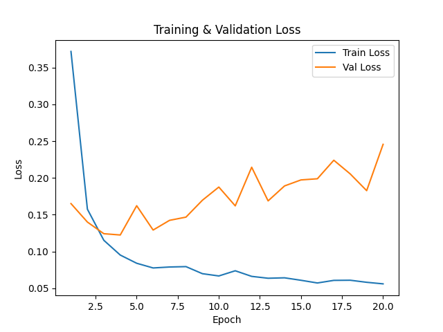
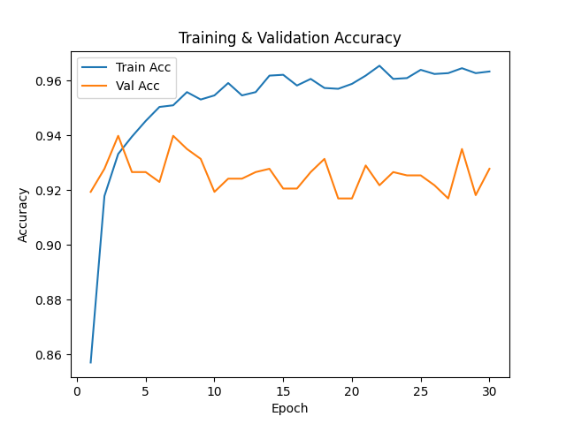
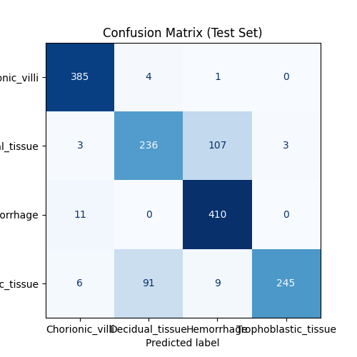
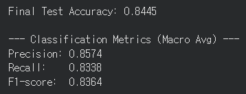

# 🧬 DenseNet-Based Histology Image Classification

This repository contains an implementation of a **DenseNet-121 classifier** trained on a custom **POC histology dataset** as part of a **Computer Vision assignment**.

---

## 👤 Student Information
**Name:** MinHwan Noh  
**Student ID:** 2022113600  
**Course:** Computer Vision  
**Framework:** PyTorch  
**Environment:** Google Colab (GPU: NVIDIA T4 / CUDA)

---

## 🚀 Project Overview

The goal of this project is to classify four types of histological tissue images using a **DenseNet-121** model pretrained on ImageNet and fine-tuned on the POC dataset.

### **Tissue Classes**
- Chorionic_villi  
- Decidual_tissue  
- Hemorrhage  
- Trophoblastic_tissue  

This dataset contains real histological images organized into class-specific folders.

---

## 📁 Dataset Structure & Splitting

The dataset is stored in Google Drive 

### **Train / Validation / Test Split**

The `Training/` folder is loaded first and then split randomly into:

- **Train:** 80%  
- **Validation:** 20%  

The `Testing/` folder is used only for **final performance evaluation**.

---

## 🧠 Model Description

This project uses **DenseNet-121** from `torchvision.models`:

- **Backbone:** DenseNet-121  
- **Weights:** ImageNet pretrained  
- **Modified classifier:**  

---

## 🎨 Data Augmentation (Training Only)

To improve generalization and reduce overfitting, the following augmentations are applied to the **training set only**:

- Random horizontal flip  
- Random vertical flip  
- Random rotation (±15°)  
- Color jitter (brightness / contrast / saturation / hue)

Validation and test images use only resizing and normalization (no augmentation).

---

## ⚙️ Training Configuration

- **Optimizer:** Adam  
  - Learning Rate: `1e-4`  
  - Weight Decay: `1e-4` (L2 regularization)

- **Loss Function:** CrossEntropyLoss  
- **Epochs:** 30  
- **Batch Size:** 32  
- **Device:** CUDA (T4 GPU) if available  

### **Best Model Saving**
The model is saved automatically when validation accuracy improves

---

## 🧪 Final Evaluation on Test Set

After training is complete, the best checkpoint is loaded and evaluated on the **independent test set**.

The following metrics are computed:

- **Test Accuracy**
- **Precision** (per class & macro)
- **Recall** (per class & macro)
- **F1-score** (per class & macro)
- **Full classification report**
- **Confusion matrix**

---

## 📉 Loss Curve

## 📈 Accuracy Curve

## 🧪 Confusion Matrix

## Metrics

